# Data durability and recovery

In this project you will create highly available solutions to common use cases. You will build a Multi-AvailabilityZone, Multi-Region database and show how to use it in multiple geographically separate AWS regions. You will also build a website hosting solution that is versioned so that any data destruction and accidents can be quickly and easily undone.

### Part 1 - Data durability and recovery

#### Relational Database Resilience

##### Criteria

Build networks that will continue to operate through the loss of a single data center.

##### Meets Specification

Screenshots of successfully created VPCs in two different AWS regions.

1. Primary VPC located in ap-southeast-2 (Sydney).
   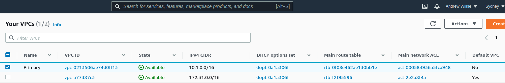
   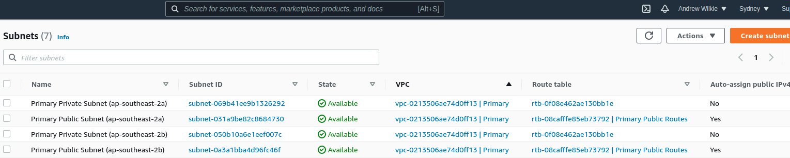
2. Secondary VPC located in ap-southeast-1 (Singapore).
   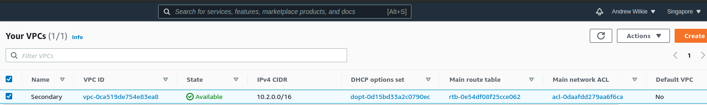
   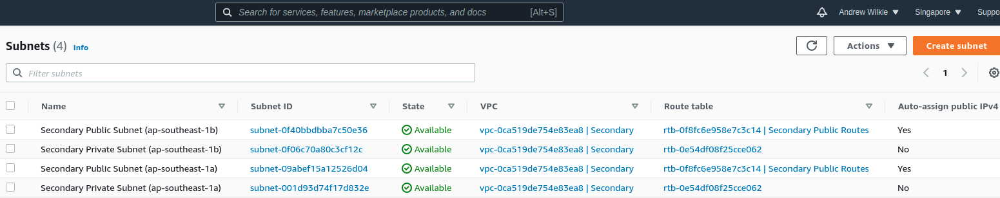

### Highly durable RDS Database

1. Create a new RDS Subnet group in the active and standby region.
2. Create a new MySQL, multi-AZ database in the active region. The database must:
   - Be a “burstable” instance class.
   - Have only the “UDARR-Database” security group.
   - Have an initial database called “udacity.”
3. Create a read replica database in the standby region. This database has the same requirements as the database in the active region.

#### Relational Database Resilience

##### Criteria

Build systems that align to a business availability objectives for redundancy.

##### Meets Specification

- Screenshot of a MySQL database configured to run in multiple availability zones in the "Primary" VPC. Database must have automatic backups enabled and be in a private subnet.

  - Primary DB subnet group located in ap-southeast-2 (Sydney).
    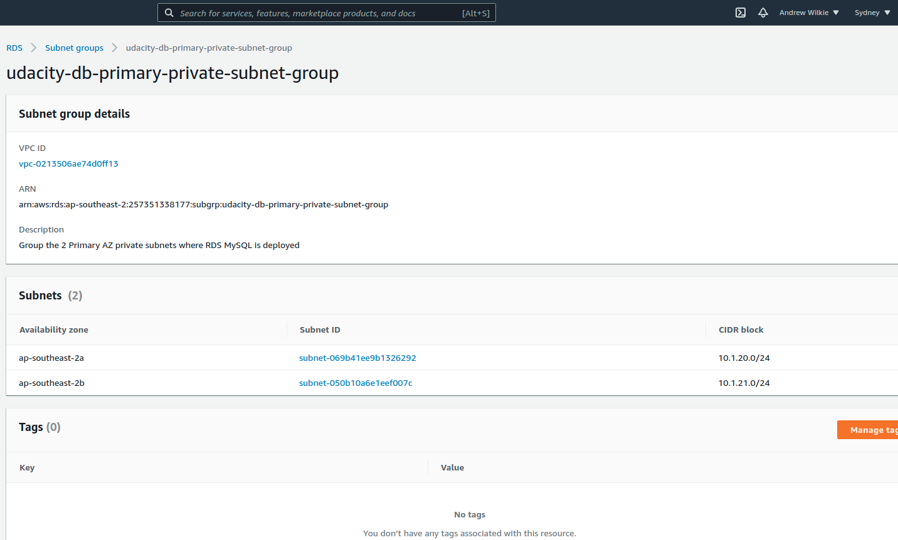
  - Primary MySQL DB RDS configuration running in ap-southeast-2 Region on private subnets "*6292" + "*007c".
    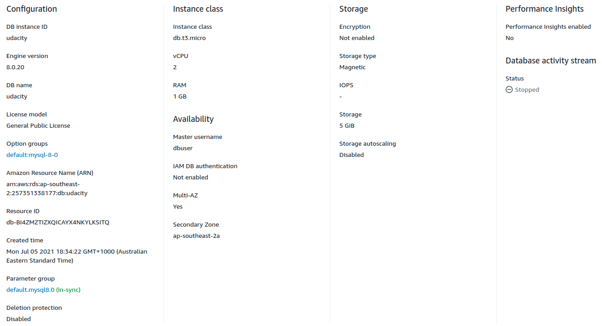
  - Primary MySQL DB RDS automatic backups.
    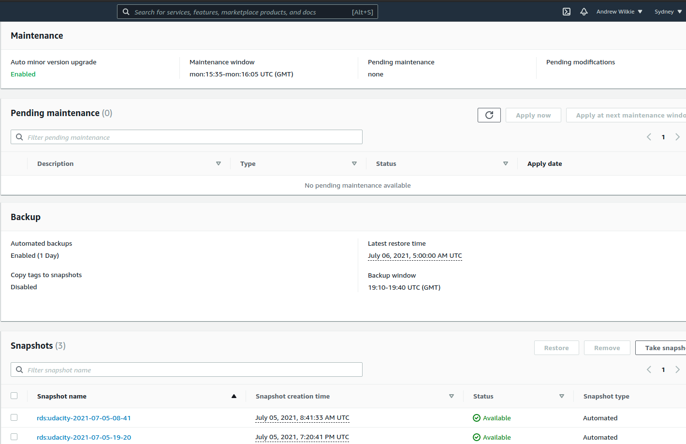

- Screenshot of a read-replica MySQL database configured to run in the "Secondary" VPC. Database must be in a private subnet.

  - Secondary DB subnet group located in ap-southeast-1 (Singapore).
    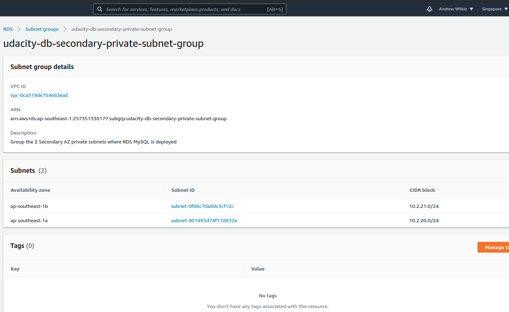
  - Secondary MySQL DB RDS configuration running in ap-southeast-1 Region on private subnets "*f12c" + "*832e".
    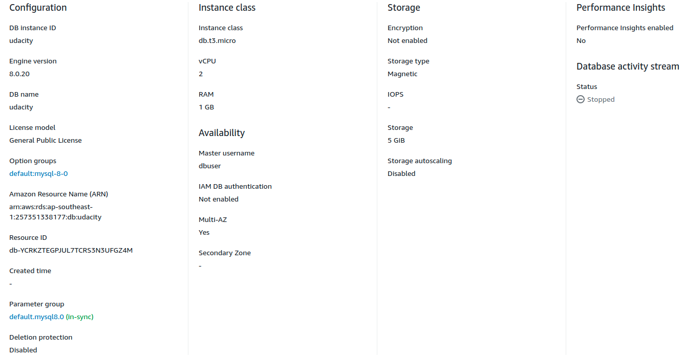

- Screenshot of route tables for the configured database subnets.

  - Primary subnet group route table of private subnets located in ap-southeast-2 (Sydney).

    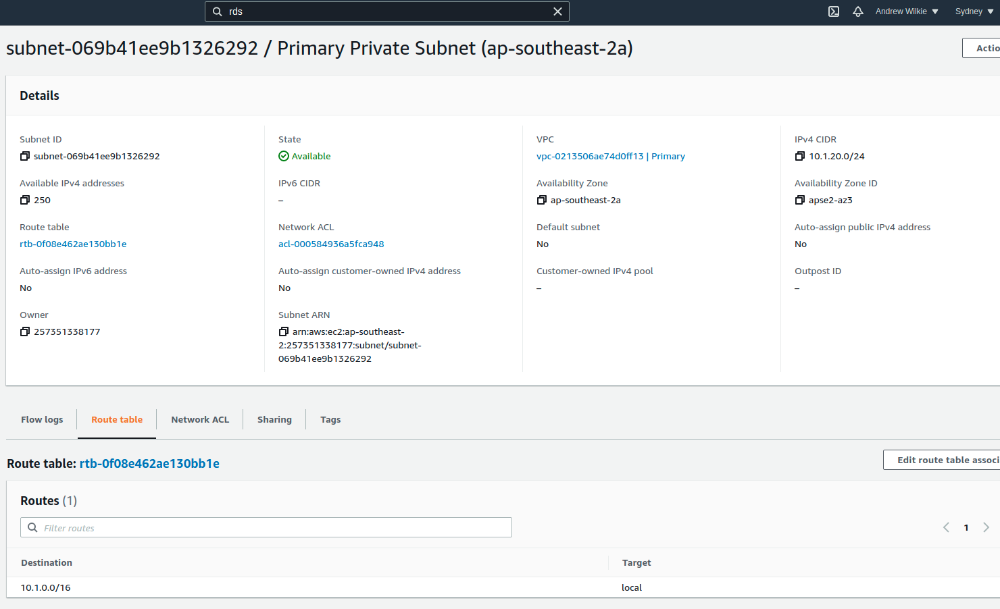
    

  - Secondary subnet group route table of private subnets located in ap-southeast-1 (Singapore).

    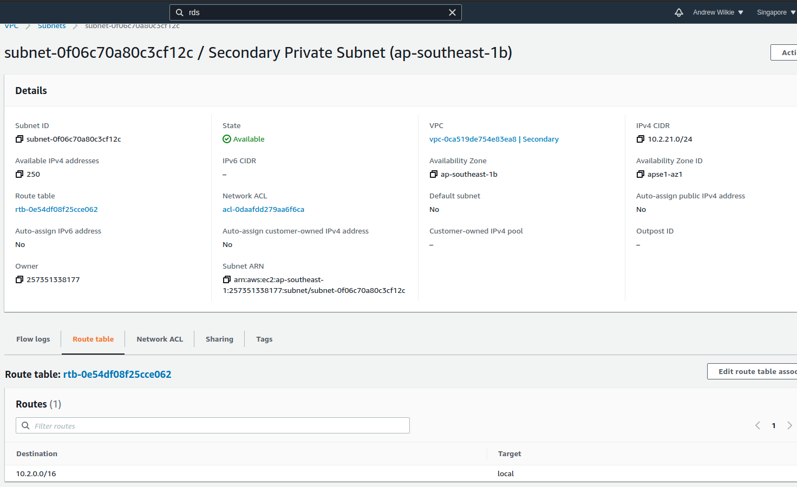
    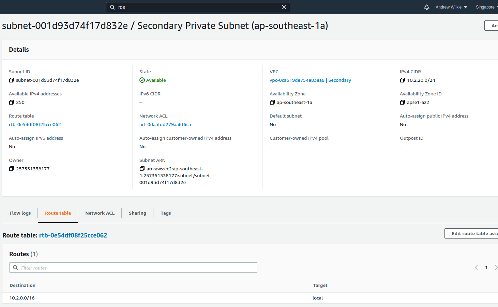

#### Manage applications in AWS

##### Criteria

Predict the availability of a configuration.

##### Meets Specification

Paragraph describing the Recovery Time Objective (RTO) and Recovery Point Objective (RPO) of this database configuration

- See [estimates.txt](./estimates.txt)

##### Criteria

Use correct data access patterns.

##### Meets Specification

Log of the student connecting to, reading from and writing to the primary database

- See [log_primary.txt](./log_primary.txt)

Log of the student connecting to the read-replica database and being able to read data from the database, but not able to write (insert) data.

- See [log_secondary.txt](./log_secondary.txt)

##### Criteria

Monitor highly available system.

##### Meets Specification

- Screenshot of “Database connections” metric of database.
  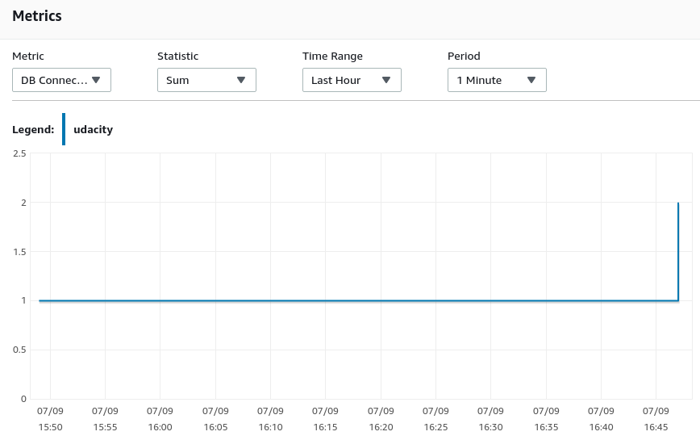

- Screenshot showing database replica configuration.
  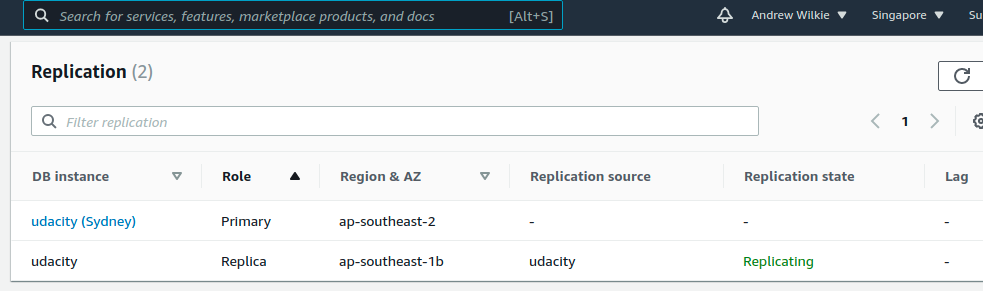
  

### Part 2

### Failover And Recovery

##### Criteria

Operate a highly resilient database.

##### Meets Specification

- Screenshot of the read-replica database BEFORE promotion.
  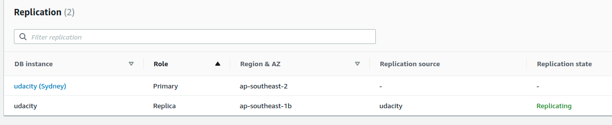

- Screenshot of the read-replica database AFTER promotion.
  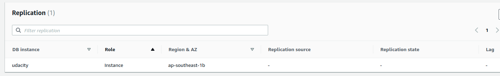

- Log of the student connecting to, reading from, and writing to the database in the standby region, after promotion.
  - See [log_rr_after_promotion.txt](./log_rr_after_promotion.txt)

### Part 3

### Website Resiliency

Build a resilient static web hosting solution in AWS. Create a versioned S3 bucket and configure it as a static website.

1. Enter “index.html” for both Index document and Error document
2. Upload the files from the GitHub repo (under `/project/s3/`)
3. Paste URL into a web browser to see your website.

**Save** the screenshot of the webpage. Name your screenshot "s3_original.png"
You will now “accidentally” change the contents of the website such that it is no longer serving the correct content

You will now “accidentally” change the contents of the website such that it is no longer serving the correct content

1. Change `index.html` to refer to a different “season”
2. Re-upload `index.html`
3. Refresh web page

**SAVE** a screenshot of the modified webpage. Name your screenshot "s3_season.png"

You will now need to “recover” the website by rolling the content back to a previous version.

1. Recover the `index.html` object back to the original version
2. Refresh web page

**SAVE** a screenshot of the modified webpage. Name your screenshot "s3_season_revert.png"

You will now “accidentally” delete contents from the S3 bucket. Delete “winter.jpg”

**SAVE** screenshots of the modified webpage and of the existing versions of the file showing the "Deletion marker". Name your screenshots: s3_deletion.png, s3_delete_marker.png

You will now need to “recover” the object:

1. Recover the deleted object
2. Refresh web page

**SAVE** a screenshot of the modified webpage. Name your screenshot "s3_delete_revert.png"

## License
