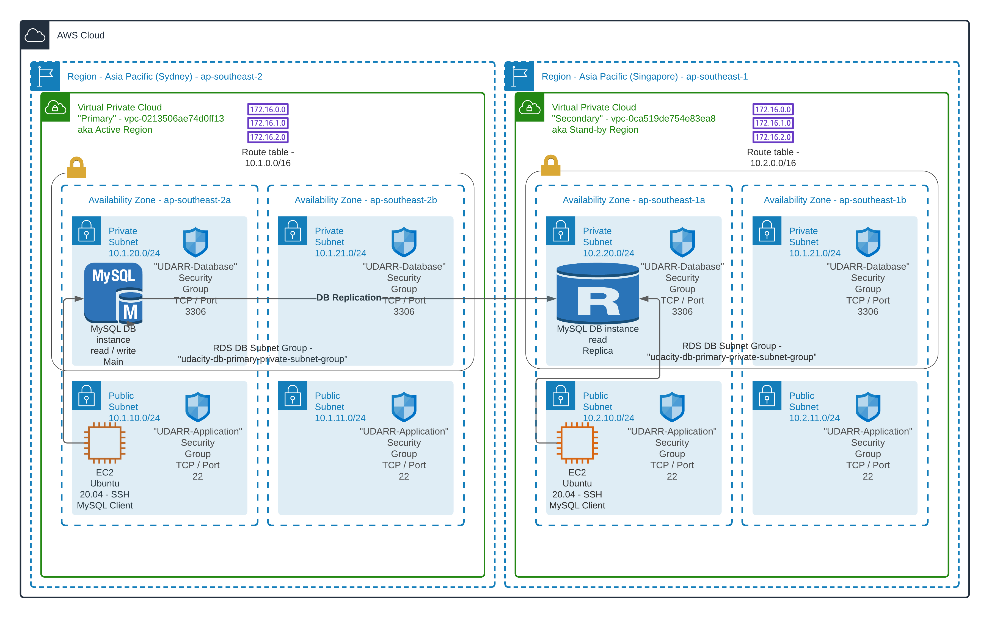
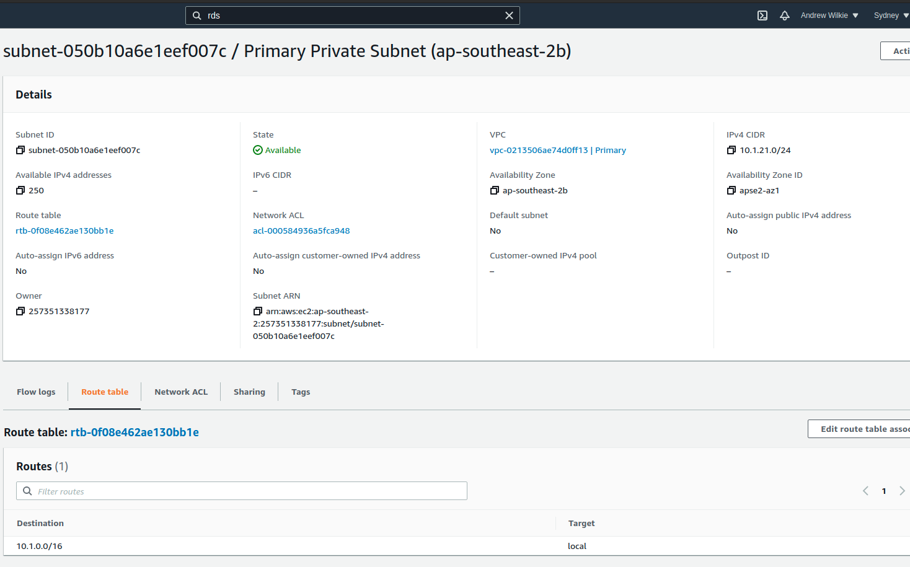
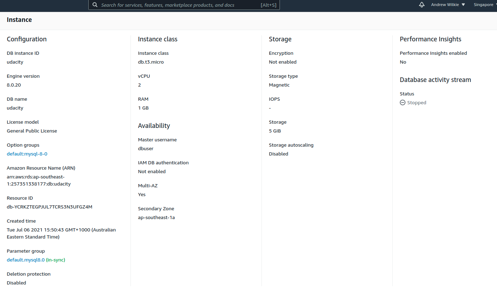
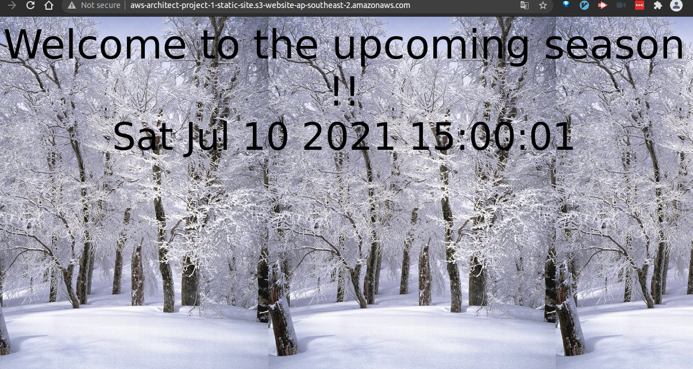
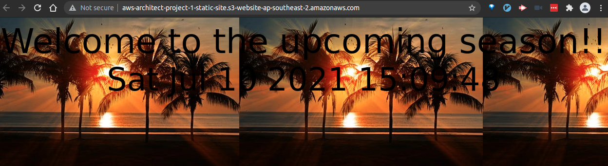
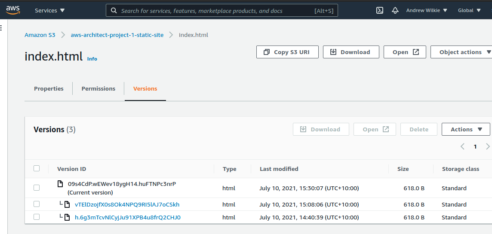
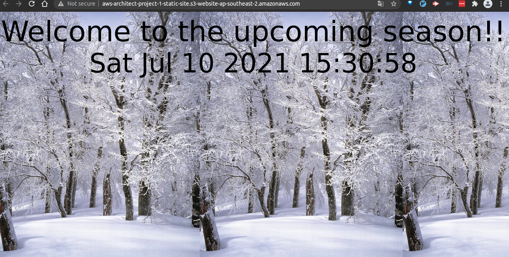
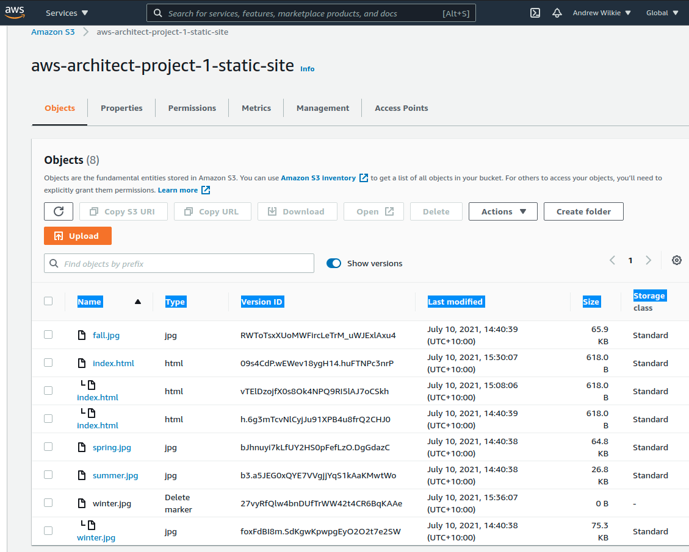
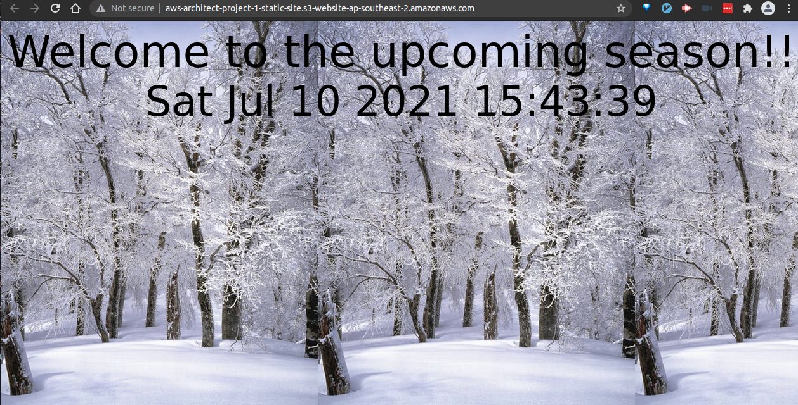

# Recoverability In AWS

## Project 1 of 3 in AWS Cloud Architect Nanodegree at Udacity

In this project you will create highly available solutions to common use cases. You will build a Multi-AvailabilityZone, Multi-Region database and show how to use it in multiple geographically separate AWS regions. You will also build a website hosting solution that is versioned so that any data destruction and accidents can be quickly and easily undone.

### My Architecture Design

- 

### Part 1 - Data durability and recovery

#### Relational Database Resilience

##### Criteria

Build networks that will continue to operate through the loss of a single data center.

##### Meets Specification

Screenshots of successfully created VPCs in two different AWS regions.

1. Primary VPC located in ap-southeast-2 (Sydney).
   
   
2. Secondary VPC located in ap-southeast-1 (Singapore).
   
   

#### Relational Database Resilience

##### Criteria

Build systems that align to a business availability objectives for redundancy.

##### Meets Specification

- Screenshot of a MySQL database configured to run in multiple availability zones in the "Primary" VPC. Database must have automatic backups enabled and be in a private subnet.

  - Primary DB subnet group located in ap-southeast-2 (Sydney).
    
  - Primary MySQL DB RDS configuration running in ap-southeast-2 Region on private subnets "*6292" + "*007c".
    
  - Primary MySQL DB RDS automatic backups.
    

- Screenshot of a read-replica MySQL database configured to run in the "Secondary" VPC. Database must be in a private subnet.

  - Secondary DB subnet group located in ap-southeast-1 (Singapore).
    
  - Secondary MySQL DB RDS configuration running in ap-southeast-1 Region on private subnets "*f12c" + "*832e".
    

- Screenshot of route tables for the configured database subnets.

  - Primary subnet group route table of private subnets located in ap-southeast-2 (Sydney).

    
    

  - Secondary subnet group route table of private subnets located in ap-southeast-1 (Singapore).

    
    

#### Manage applications in AWS

##### Criteria

Predict the availability of a configuration.

##### Meets Specification

Paragraph describing the Recovery Time Objective (RTO) and Recovery Point Objective (RPO) of this database configuration

- See [estimates.txt](estimates.txt)

##### Criteria

Use correct data access patterns.

##### Meets Specification

Log of the student connecting to, reading from and writing to the primary database

- See [log_primary.txt](log_primary.txt)

Log of the student connecting to the read-replica database and being able to read data from the database, but not able to write (insert) data.

- See [log_secondary.txt](log_secondary.txt)

##### Criteria

Monitor highly available system.

##### Meets Specification

- Screenshot of “Database connections” metric of database.
  

- Screenshot showing database replica configuration.
  
  

### Part 2

### Failover And Recovery

##### Criteria

Operate a highly resilient database.

##### Meets Specification

- Screenshot of the read-replica database BEFORE promotion.
  

- Screenshot of the read-replica database AFTER promotion.
  

- Log of the student connecting to, reading from, and writing to the database in the standby region, after promotion.
  - See [log_rr_after_promotion.txt](log_rr_after_promotion.txt)

### Part 3

### Website Recovery

##### Criteria

Create a versioned website.

##### Meets Specification

- Screenshot of the [website](http://aws-architect-project-1-static-site.s3-website-ap-southeast-2.amazonaws.com/) with a winter scene as the background and displaying a timestamp.
  

##### Criteria

Recover from “accidental” modification to website.

##### Meets Specification

- Screenshot of same website with a different season (picture) as the background, still displaying a timestamp.
  

You will now need to “recover” the website by rolling the content back to a previous version.

1. Recover the `index.html` object back to the original version
2. Refresh web page

- Screenshot of AWS S3 object “index.html” showing multiple versions of the object exist.
  

- Screenshot of the same website once again with the original background, still displaying a timestamp.
  

You will now “accidentally” delete contents from the S3 bucket. Delete “winter.jpg”

- Screenshot of the same website with no background image.
  

- Screenshot of AWS S3 object “winter.jpg” showing multiple versions of the object exist with the latest being a “deletion marker”.
  

- Screenshot of the same website once again with the original background, still displaying a timestamp.
  
